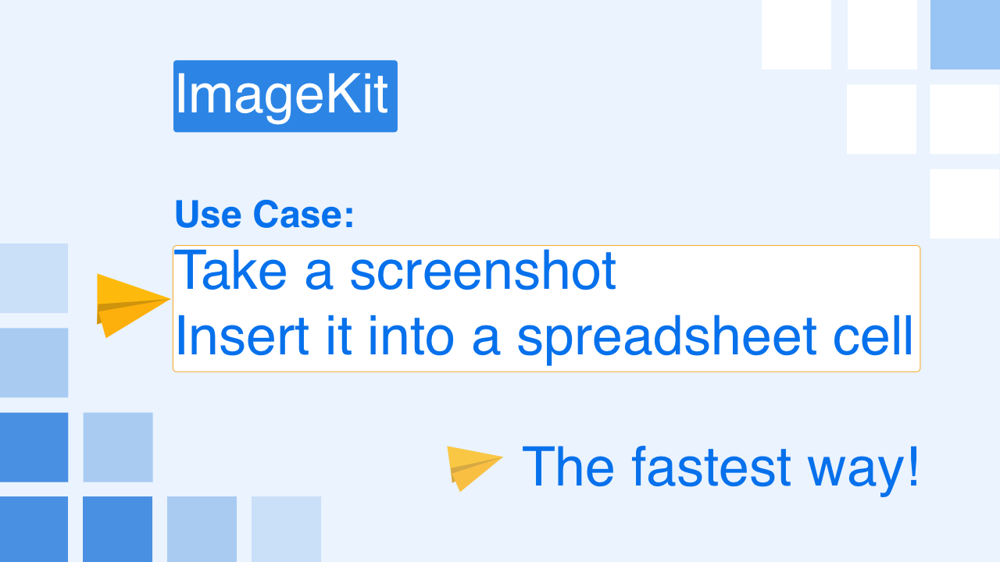
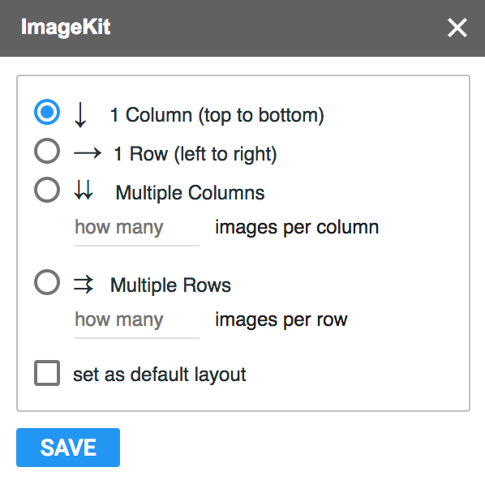

[Install from Workspace store](https://workspace.google.com/marketplace/app/imagekit/293792448784)
Features
ImageKit makes it easier to insert in-cell images in Google Sheets™.  

In-cell image insertion in Google Sheets™ can be difficult, but ImageKit saves you.

What you get:

direct image insertion without needing to use formulas

the ability to insert multiple images

the option of selecting images from your computer, Google Drive, Google Image Search or by using any image URL.

MULTIPLE IMAGES DIRECT INSERT TO CELL, BYEBYE FORMULA!
You don’t have to insert images one-by-one. Instead we enable you to insert multiple images at the same time. Efficiency achieved!

Pick image from multiple sources
No matter where your images are, you pick them easily.

We have an easy to use URL input box that you can use to insert several images at once.Don't know how to get the web image's URL address? Check [this](https://www.machinefriendly.com/gsuite-google-spreadsheet-addon-imagekit#faq-howtogetimgurlhttps://www.machinefriendly.com/gsuite-google-spreadsheet-addon-imagekit#faq-howtogetimgurl).

You may also pick images from you computer, your Google Drive, and Google Image Search.

smart URL
For certain, popular websites and their image pages, you don't need take time looking for image URLs- Just use that page URL directly.

This could be super convenient for some web based screenshot services, such as [Cloudapp](https://www.getcloudapp.com/), Droplr and Lightshot. They automatically copy the image PAGE URL to your clipboard, and the only thing you have to do is to paste that URL into ImageKit. ImageKit can then find and insert the correct image.

Please find this screenshot video showing you how ImageKit works with Cloudapp.

Please find below the supported smart URLs, and please note that only an image's page's URL can be used as a smart URL.

 | CloudApp ► automatically generated screenshot URL, ex: https://cl.ly/0Q0J1b3P0l11
 | Droplr ► automatically generated screenshot URL, ex: http://d.pr/FREE/RQa2Oe,http://d.pr/RQa2Oe
 | Lightshot ► automatically generated screenshot URL, ex: https://prnt.sc/iw5o84
 | Screencast ► use Techsmith's tools (Jing or Snagit) to take screenshout, and select save it to screencast.com, an automatically generated URL will be generated. ex. http://www.screencast.com/t/R2UCUt14cUe
 | Imgur ► an URL generated after you upload an image to imgur.com, ex. https://imgur.com/gallery/b6blaD7
 | Instagram ► an URL of page containing only one photo or video, ex: https://www.instagram.com/p/Be8h1LkBHxu/ 
 | Pinterest ► an URL of page containing only one photo or video, ex: https://www.pinterest.fr/pin/144044888065356318/ 
Tell us what other websites you want smart URLs to handle by commenting here on our Trello board.

personalized layout
It was not easy to arrange multiple images’ layout order in Google Sheets™, but now you can configure the output layout and images will appear in the order that you want them to.
The add-on will remind you about the layout once you select multiple images to insert.

 

Google workspace ADMIN SETTING
For Google Workspace Enterprise edition (those with own domain name), organisation’s Google Workspace administrator is supposed to grant public sharing access for files in user’s My Drive, without this access, the image uploaded to and selected from user’s Google Drive cannot be shown in Google Sheets™ by ImageKit.
Administrator, please enter your Google Admin and grant access with below setting:

